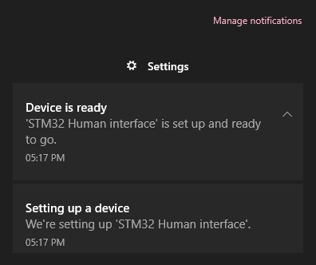
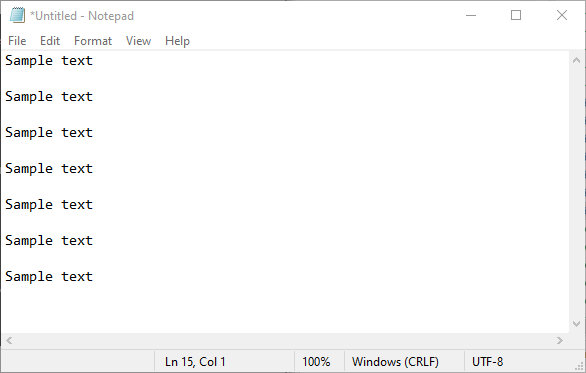

# stm32-keyboard-ctrl-c-v

<h4>I/O to key mapping</h4>

| I/O | Key | Description |
| --- | --- | --- |
| PD12 | Ctrl | Pressed when shorted to GND, internal pull-ups |
| PD13 | C | Pressed when shorted to GND, internal pull-ups |
| PD14 | V | Pressed when shorted to GND, internal pull-ups |

<h3>Screenshots</h3>

<h4>Notification on connect</h4>

<h4>Ctrl-C and Ctrl-V in action</h4>

